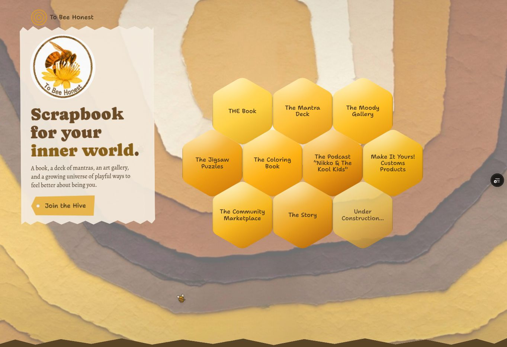

# To Bee Honest mobile performance validation — October 6, 2026

Implemented in [PR #1](https://github.com/max-strong-1/tobeehonest-site/pull/1), branch `perf/mobile-image-delivery`. Production remains unchanged; this report validates a preview.

## Measurement

Both fresh measurements use PageSpeed Insights: Lighthouse 13.5.0, HeadlessChromium 153.0.8010.36, emulated Moto G Power, Slow 4G, single initial page load. These are simulated lab metrics, not field data. PSI reports no field data. Exact October 5 raw settings were not supplied, so the fresh October 6 production baseline is the paired comparison.

| Metric | Oct 5 report supplied by Kel | Fresh production baseline, 9:26 EDT | Final preview, 9:40 EDT |
| --- | ---: | ---: | ---: |
| Mobile performance | 68 | 66 | 76 |
| Mobile LCP | 20.9 s | 20.9 s (20,858 ms) | 4.4 s (4,351 ms) |
| Total mobile transfer | 8,649 KiB | 8,649 KiB | 531 KiB |
| Mobile FCP | — | 3.3 s | 3.3 s |
| Mobile CLS | — | 0 | 0 |
| Mobile TBT | — | 0 ms | 0 ms |
| Desktop LCP | 2.1 s | Not separately recorded | 1.0 s |

Mobile LCP improved about 79%; transfer fell about 94% (8,118 KiB). The after URL is a Vercel preview on the same project, not the production hostname. Host/run variability remains; no production-after result is claimed. Desktop preview scored 98.

Evidence:

- [Production baseline](https://pagespeed.web.dev/analysis/https-tobeehonest-com/3o34fr0bvr?form_factor=mobile)
- [Final mobile preview measurement](https://pagespeed.web.dev/analysis/https-tobeehonest-site-jh4vpbzgv-kels-projects-9ec3fa5c-vercel-app/55cjjbo7vh?form_factor=mobile)
- [Optimized preview](https://tobeehonest-site-jh4vpbzgv-kels-projects-9ec3fa5c.vercel.app/)
- Measured code commit: `ad14107c398a72e7d412dc42fe6c8a21a08b174b`; baseline main: `2bacfdf40e322d81b4bd984d1cc9cc0ba5e16429`.

## Actual LCP and initial image transfers

The production mobile LCP discovery and breakdown both identify `div.tier-inner > div.cover-art > picture > img`, selecting `assets/web/cover-hero-sky-rings-v2.png`. The trace says it is discoverable from initial HTML and not lazy, but lacks high fetch priority.

| Initial image | Baseline transfer, KiB |
| --- | ---: |
| cover-hero-sky-rings-v2.png | 2,084.5 |
| sun-bird-puzzle-prodigi-preview.png | 1,646.5 |
| sun-bird-puzzle-tin-approved.png | 1,292.4 |
| butterfly-tower.jpg | 471.6 |
| deck-cards/card-back.jpg | 372.4 |
| deck-cards/card-26.jpg | 366.5 |
| deck-cards/card-05.jpg (random drawn card) | 355.4 |
| deck-cards/card-15.jpg | 326.4 |
| deck-cards/card-04.jpg | 303.9 |
| deck-cards/card-11.jpg | 286.3 |

The logo image audit records another 222.8 KiB. Random drawn-card filenames and bytes vary per visit. The cover keeps the next chapter rendered underneath it, so native lazy loading alone does not prevent the puzzle previews from fetching immediately.

## Small changes made

- Added responsive WebP mobile cover variants (480/941 px) with the original PNG source retained as a fallback. The 941 px asset is 94,904 bytes; PSI final transfer is 93.2 KiB. Only this measured mobile LCP is preloaded, with matching `imagesrcset`, `imagesizes`, type and mobile media query. Cover image is eager with `fetchpriority="high"`; the desktop artwork stays the same.
- Added 220/440 px WebP logo variants, with sizes matching the existing desktop and mobile layouts. Final mobile logo transfer is 10.6 KiB.
- Added 320/640/1254 px WebP puzzle product variants with original PNG fallback URLs retained. Deferred the two product `source`/`img` URLs until the current chapter's `paint()` call activates them. Their requests remain native-lazy once activated; the URLs stay set when leaving/revisiting the chapter.
- Added lazy/async attributes to previously eager non-cover chapter images, including the dynamically drawn card faces. The card controller still sets the original approved artwork and retains its interactions.
- Scoped cursor stylesheet loading to `(pointer: fine) and (hover: hover)`, matching its existing behavior. Other styles and Google Fonts remain synchronous because chapter styles also affect the cover.

WebP files were generated from the original images using Sharp: width-only resize, no enlargement, quality 85, effort 6, original aspect ratio retained. Original source images remain in the repository.

## Verification

- All 114 existing `npm test` tests pass after the final code changes; `git diff --check` passes.
- Live preview cover layout was visually compared with current production at the same desktop viewport.
- Before puzzle entry, both product images have no `src` or selected `currentSrc`; their URLs are held in `data-src`. On entry, both select their WebP variants and finish decoding. Product artwork renders in its existing layout.
- Deck navigation and a drawn-card flip work; the revealed count advances to 1 of 54 and both drawn photos report complete with `loading="lazy"`.
- Mobile and desktop final lab screenshots/layout metrics show CLS 0. Existing accessibility score remains 96; best-practices and SEO remain 100.
- No purchase was made and no checkout or fulfillment changes were introduced.

## Remaining work and release

The final initial payload's largest images are the puzzle game's existing WebP (194.5 KiB) and mobile hero (93.2 KiB). The game artwork remains loaded because the next chapter remains rendered for the existing scrapbook transition.

The final trace still estimates 2,220 ms of blocking-resource savings. Mobile LCP 4.4 s is improved but remains above the 2.5 s good target. Google Fonts and cover-affecting styles are the next measured bottleneck; deferring them indiscriminately would risk font or geometry changes. The small cursor media change did not materially improve rounded LCP.

After separately authorized production release, rerun PSI against `https://tobeehonest.com/` with the same mobile settings and verify the WebP LCP, transferred bytes, cover appearance, puzzle image activation, and card interaction. To roll back, revert the performance commits and redeploy the prior main. The original media is retained.
